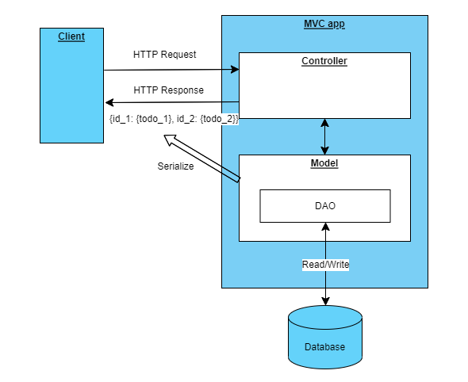

# Design document of TODO_RestfulAPI
## Requirements
- Build up a web server to response the HTTP requests for managing TODOs
- Operations on a TODO:
    - CRUD
    - Filtering: by **name** (fuzzy search) and/or **status**
    - Sorting: by **due_date** and/or **status**
- Data persistent

## Test Cases
| No. | Test case name     | Description                                                                                       | Expect Response                                                            | Sample command (use curl)                                                                                                                |
|:----|:-------------------|:--------------------------------------------------------------------------------------------------|:---------------------------------------------------------------------------|:-----------------------------------------------------------------------------------------------------------------------------------------|
| 1   | Sever connection   | Test if the web server is working.                                                                | 200. message "Hello, World!"                                               | curl -X GET localhost:5000                                                                                                               |
| 2   | Get all TODOs      | Get all TODOs from server.                                                                        | 200. json-formatted TODO dictionary {id_1: {todo_1}, id_2: {todo_2}, ..}   | curl -X GET localhost:5000/todo/tasks                                                                                                    |
| 3   | Get a TODO by ID   | Get a specified TODO by its ID                                                                    | 200. json-formatted TODO {name: 'Some todo', description: 'Something', ..} | curl -X GET localhost:5000/todo/tasks/1                                                                                                  |
| 4   | Create a TODO      | Insert a new TODO to server                                                                       | 201. json-formatted TODO {name: 'Some todo', description: 'Something', ..} | curl -X POST localhost:5000/todo/tasks -H "Content-Type:application/json" -d '{"name": "Task name", "description": "Write something.."}' |
| 5   | Update a TODO      | Modify information of a TODO                                                                      | 200. json-formatted TODO {name: 'Some todo', description: 'Something', ..} | curl -X PUT localhost:5000/todo/tasks/13 -H "Content-Type:application/json" -d '{"status": "C"}'                                         |
| 6   | Delete a TODO      | Completely delete a TODO from database                                                            | 204.                                                                       | curl -X DELETE localhost:5000/todo/tasks/14                                                                                              |
| 7   | Get filtered TODOs | Fuzzy search TODOs that contains the required name and/or in the specified status                 | 200. json-formatted TODO dictionary {id_1: {todo_1}, id_2: {todo_2}, ..}   | curl -X POST localhost:5000/todo/tasks/filter -H "Content-Type:application/json" -d '{"status": "D", "name": "water"}'                   |
| 8   | Get sorted TODOs   | Sort TODOs by due_date and/or status. Only Completed TODO will be returned if sorting by due_date | 200. json-formatted TODO list [{todo_1}, {todo_2}, ..]                     | curl -X POST localhost:5000/todo/tasks/sort -H "Content-Type:application/json" -d '{"name": true, "due_date": true}'                     |

## System Design

### Architecture Diagram

### Class illustration
#### TODO
Properties:
- id 
  - Type: integer
  - Allow duplicates: false
  - Nullable: false
  - Description: Primary key of the TODOs
- name
  - Type: string
  - Allow duplicates: false
  - Nullable: false
  - Description: Task name of a todo
- description
  - Type: string
  - Allow duplicates: true
  - Nullable: true
  - Description: Task summary of a todo
- due_date
  - Type: datetime
  - Allow duplicates: true
  - Nullable: true
  - Description: Due date have value only if the status of a TODO is 'C' or 'D' and had been completed before deletion
- status
  - Type: string
  - Allow duplicates: true
  - Nullable: false
  - Values: 'I', 'C', 'D'
  - Description: Task status. I: in progress, C: completed, D: deleted by user